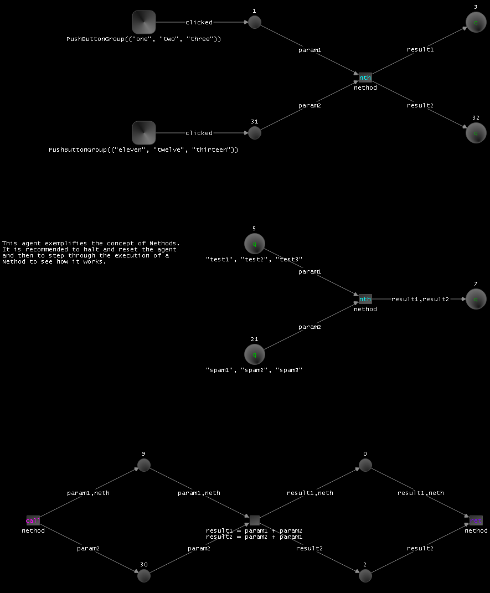

# Pytrithon
Graphical Petri-Net Inspired Agent Oriented Programming Language Based On Python
## Prototype
The prototype of Pytrithon consists of three different process types. First the Nexi, which connect all Agents running on a system, and can be connected to other Nexi. Second the actual Agents running, which are Python processes relying on an Agent core, which execute the Agent net structure by firing Transitions and managing Tokens in-between Transitions and Places. Third the Monipulators, which allow viewing, editing, interacting with Agent nets.

The default workflow for editing is running a Nexus and the Agents you are interested in through the `nexus` script, with '`-me`' for opening the Agents in `edit` mode and starting a Monipulator, whenever you want to program the Agent nets. To just run the Agents without a Monipulator, no dash arguments are needed.
### Installation
It is recommended to have Python 3.13 installed. To install all required Python packages you can use `"pip install -r requirements.txt"`.
### Exploration
Your main area of interest when using Pytrithon should be the workbench folder, where all Agents and their Python files are situated. The Pytrithon folder is the backstage which makes the magic happen.

In order to explore the language it is recommended to open several of the example Agents in the Monipulator. Using `"python nexus -l"` you can request a list of all available Agents, and using `"python nexus -m <agentname>"` you can open an Agent in the Monipulator and have it running in order to examine the language.

You can also explore the Agents buy running the `pytrithon` script to open a Nexus with a Monipulator and opening Agents through the menu or `ctrl-o`.

Recommended Agents to try are "basic", "calculator", "kniffel", "guess", one "pokerserver" with multiple "poker", and one "chatserver" with multiple "chat".
You also should try running TMWOTY2 with the script of the same name.

Here is a snapshot of the "basic" Agent:

### Nexus
This process is the main entry-point of the whole system of Agents. This script allows starting a nexus, optionally a Monipulator, and a set of Agents, all in one call. It offers all the combined command line parameters of all Agents and the Monipulator started, so that their startup configuration can be specified concisely.

A Nexus is required to be running on each system that wants to execute Agents. It is the central hub allowing for managing Agents and supplies inter Agent communication methods.

The command line arguments for the `nexus` script include all arguments for the `agent` and `moni` script and these additional ones:
- `list`: Lists all available agents and fragments
- `name`: Configure the name of the Nexus
- `PORT`: Set the port the Nexus listens to
- `nexus`: Instruct the Nexus to connect to another Nexus to create a linked system of Nexi, which allow cross system interactions between Agents, by supplying an address, and optionally a colon separated port
- `args`: Specify the Agent arguments for each started Agent. This argument should be the very last and be followed with the spaces-separated Agent arguments

The defaults for all these arguments and those of the `agent` and `moni` script can be configured in the `config.yaml` configuration file. Each argument default that is configured here affects the direction of effect of explicit arguments. The actual arguments toggle between both states, either reenabling a disabled argument, or disabling an enabled argument.

After all those arguments, the command should be followed with a list of Agents to start right away, or a list of Fragments to be opened in the Monipulator, which start with a dollar sign.

In theory, the prototype should support distributing Nexi across multiple systems. To do that, after starting a Nexus remotely, you can start multiple new local Nexi connecting to the remote Nexus by using `"python nexus -mn <localnexusname> -x <remoteaddress>"`. Then you can for example start a `"chatserver"` Agent on the remote system, and several `"chat"` Agents on the local systems.
### Agent
This process starts a single Agent, whose initial state is configurable with command line parameters. In order to launch an Agent, its name has to be specified, which is used to lookup the actual Agent net and run the Agent. Agent arguments can be infused on starting an Agent by adding arguments to the Agent starting script, which are accessible through the `args` value in Module Meta Elements or through an `args` Knowledge Place.

Agents can be in multiple different states. A very important state is the `edit` mode, where the Agent is only partially started and does not run.

The command line arguments for the `agent` script are:
- `PORT`: The port on which the local Nexus to connect to is running
- `delay`: The delay in milliseconds between each simulation step, firing of a Transition
- `poll`: The idle polling resolution in milliseconds
- `timeout`: The time of inaction in seconds which deems an Agent ended
- `edit`: Starts this Agent in edit mode
- `HALT`: Starts this Agent halted
- `secret`: Disable displaying the contents of an Agent's Places in the Monipulator
- `MUTE`: Disable the Agent's regular print output
- `ERRORS`: Enable the Agent's error print output
### Monipulator
This process is the central GUI to program Agents. It interacts with the Nexus and all running Agents in order to show their net structures and allows interacting with the Agents.

The command line arguments for the `moni` script are:
- `PORT`: The port of the local Nexus to connect to
- `console`: Open the console of the Monipulator, where all print statements inside the Agents are routed to
- `bundle`: If bundled, all Agents print to a single console, if not bundled, each Agent receives its very own console
- `info`: Print Monipulator information notices to the console
- `open`: Show the first Agent net as soon as one is opened in the Monipulator
- `light`: Use light mode in the Monipulator with a white background, instead of the default night mode
- `quit`: Terminates the local nexus and all local agents when Monipulator is closed
- `zoom`: Set the zoom for the Monipulator
- `font`: Set the font and font size for the Monipulator, separated with a colon

The Monipulator allows changing the state of an Agent. Most of the time, `edit` mode is used to program the Agent net. In this state, the Agent does not execute but allows being modified extensively. This mode is required to create new Elements and modify all possible parameters of the Agent net.

In order to modify an Agent net, the right mouse button is extensively used in the Monipulator. By clicking right on an empty spot of the Agent net, a menu is shown, which allows adding new Elements to the Agent. In order to modify parameters of Elements and Arcs, clicking right on them opens a modification menu. Arcs can be added through using the Pytrithon Meta Language format to specify hidden or actual Arcs in a Transition's Inscription. Arcs at the top of the Inscription are hidden, those at the bottom are turned into actual Arcs. The format is either '`reads: `', '`takes: `', '`gives: `', '`writes: `', or '`clears: `', followed by a semicolon separated list of pairs of '`<alias>:<place name>`'. When the name matches the alias, as a shorthand '`:<alias>`' can be used.

In `run` mode, the Agent is active and executes firable Transitions step by step. Only a small subset of modifications can be performed by the Monipulator. The Agent can be stopped so no regular firing is performed, and individual steps can be triggered.
## Your first Agent
You start by opening a nonexisting Agent name in edit mode, either by starting a nexus with the Monipulator for a new Agent (`"python nexus -me newagent"`), or by opening a new Agent with `"ctrl-o"` in the Monipulator. The background should be green and no Elements should be shown. You can always toggle edit mode later.

### Simple triggered Python Transition
In order to add Elements to the empty Agent, you right click on an empty space in the Agent net and select the Element to spawn. You can start with any Place as a precondition, in this case probably a flow Place, and a Python Transition for the code to execute. The Place needs a Seed, for example an empty Token `"()"`, which is its initial content, by right clicking on the Place and selecting `edit seed`. To edit the Transition's Inscription, you right click on it and select `edit inscription`. In order to add an Arc from the Place to the Transition, when editing the Transition's Inscription, you add an Arc specification line after the actual code. The format for Arc specifications is `"<arctype>: <alias>:<placename>"`, eg: `"takes: foo:0"`, where the arc type is one of `"reads", "takes", "gives", "writes", or "clears"`. In this case the Place name autogenerated for the Place you just created should be `0`. When there are multiple Arcs of the same type, you can separate multiple Alias and Place name pairs with semicolons. When you exit out of editing the Transition's code and Arcs, the Arc specifications are turned into actual graphical Arcs. Arc specifications which are posited _before_ the Transition's central code block are Hidden Arcs, which are not shown as arrows, so as to not mess up the visual cohesion of the Agent net with too many arrows pointing everywhere. You can program arbitrary Python code inbetween the hidden and actual Arc specifications. Arcs without Aliases are only for control flow and are specified by just the Place name in the Arc specification (`"takes: 0"`). If the Alias and Place name are the same, you can use the shorthand `":<placename>"`. The Seed of a Place is turned into a Token on Agent startup, which can wander through the Agent. Tokens can be arbitrary Python objects. If a Transition takes from an Arc with an alias, it can access the Token through that alias in the actual code. If a Transition gives to an Arc with an Alias, it infuses the target Place with the Python object, unless the Alias does not exist after executing the code.

To spice things up, you can set the Place's Seed to a string, and in the Transition's code block, print the Token bound to the Alias `"foo"` by using the `print` function. You have the full might of Python in the code block.

### Storing the newly created Agent
When you are done modeling the Agent, you can save it by hitting `ctrl-s` or using the menu, which persistently stores the Agent code into a `.pta` file in the workbench, and allows it to be loaded by specifying the Agent name. In order to actually execute the Agent from edit mode, you can hit `ctrl-i` to initialize and run the Agent. If you want to observe the Agent more closely, you can halt the execution (`ctrl-h`), reset the Agent (`ctrl-t`), and step through it manually (`ctrl-p`). You can also use the respective Monipulator buttons in the right sidebar.

If you saved the Agent and exited the Monipulator, you can spawn it through its name with the nexus script, or by opening it in the Monipulator.

### Workflow recommendation
A recommended workflow for complex Agent clusters communicating internally is starting a Nexus in edit mode with the Monipulator and all Agents you are interested in (`"python nexus -me agent1 agent2"`), editing the Agents, saving them, quitting out of the Monipulator, and finally running the Agents, possibly without a Monipulator, by starting a Nexus anew (`"python nexus agent1 agent2"`).

Try experimenting with all Place types and Transition types. There are several preexiting Agents, which showcase their functionality.
### Adding an inlined Module
By adding a `module` Element to the Agent, you can integrate Python code that is executed at the start of the Agent. This should mainly be used to define classes and import modules for use in the actual Transitions.
## Language
The source code of a traditional textual programming language is in the form of a tree structure of many files which contain linear lines of text. The core elements of such a language are keywords, identifiers, punctuation and whitespace. These lexical tokens are in a syntactic relationship with one another. They are analyzed by a parser, combined into statements, and turned into machine code or interpreted directly. The control flow through the list of statements is mostly sequential except for jumps from function to function. This leads to more or less spaghetti code, where in bigger projects it can be hard to follow the amalgamated jumping hereto and thereto, hence debuggers are used to cope with the complexity and follow the jumps to understand the code. Traditional programming is a mess of context switches from one object’s methods to another object’s methods, to yet more objects’ methods. Also, with the exception of symmetric coroutines which are not in common usage, all those jumps usually are asymmetric with a caller and a callee that returns to that caller. The call hierarchy can be flattened by inlining the bodies of all functions into one sequence.
### Pytrithon
Pytrithon, on the other hand, is a graphical programming language. Its core Elements are based on Petri nets’ places, transitions, arcs and tokens. Programs, or rather Agents, are composed of visual Elements that are laid out on a two dimensional surface and connected to one another as a graph, as opposed to the one dimensional sequentialism of traditional textual programming languages, where statements are positioned on a vector of lines. The dependencies of the Elements are defined by drawing a graph of Elements with arcs as interconnections. In general, except for sub-Elements, all Elements of a net are peers. They cooperate directly with exactly the neighbours they are connected to. Some Elements can act proactively, others only react. They can be connected to many other Elements as opposed to just the prior and the next line as in textual languages.

An Agent written with Pytrithon is composed of several categories of Elements. Places manage the intermediate and permanent data of the Agents by holding Tokens, making them accessible in various ways, and like in a Petri net they are visualized as a circular figure. There are many different types of Places, some for single values, others for collections, and more for special uses. Places exist as variables storing a single value and collections managing a set of Tokens as several different data structures. Transitions are the proactive Elements that process the data, they are rectangular. The different types of Transitions are either differentiated through custom graphics or a textual mnemonic. The types of Transitions follow a general colorizing scheme which results from their core behavior. Apart from the basic Python Transitions that execute a snippet of Python code, there are special Transition types for communicating with other Agents. Others are used to define Nethods, which are like Methods but consist of a net structure. Through signals Tokens can be sent to and received from specific locations. There are Transitions for executing a graph flow in an iterating or mapping approach. The control flow can be split into multiple paths that are later joined through Choice and Merge Transitions. Transitions utilize Ports as general Alias identifiers for specifying their behavior. There are Transitions for general activities, for the basic control flow, and for realizing Agent communication. Transition Inscription are the programming code of the Agent and are represented through a block of text. They are also used to configure an Element as to what happens when it is executed. Arcs connect Places and Transitions to a net, mainly resulting in a bipartite graph, and are displayed as arrows with or without arrow heads. Arcs are inscribed with Aliases which allow interaction with the transported Tokens. The behavior of an Arc can be changed through several Modifiers, specified through specific ASCII characters. Arcs that input Tokens inside a Place to a Transition are called Source Arcs and those that receive Tokens from a Transition that are donated to a Place are called Target Arcs. There are also Read Arcs, which have no arrow heads, and only read a Token without movement. Write Arcs, which have arrow heads on both ends, modify a given Token, usually both by taking the Token from the Place and returning a new Token to said Place. Tokens are the basic unit of data and incorporate it in arbitrary objects and are displayed in the net through their textual representations. Gadgets are complex Elements that can be part Place and part Transition and due to this role they are displayed as squares with rounded corners around a circular body. They wrap a python object which can interact with the net structure proactively as well as reactively. The Fragment Element allows concisely displaying net structures by coarsening, or for abbreviating complex structures for use in multiple agents. Meta Elements define Agent global properties, Python module snippets, and Ontology objects. Agent Nets, which consist of the prior Elements, are the basic building blocks for nets and allow portioning the code into arbitrary chunks. Places, transitions, arcs and tokens are all concepts borrowed from Petri nets.

In Pytrithon, the original Petri net semantics is not adhered to fully. Although a Pytri net looks very similar to a Petri net it behaves differently in several crucial ways. For example a Transition does not have to donate Tokens to all output Places, can suppress certain output Places, and a Transition may fire with an atomic sub-action without all input Places having Tokens. Because no unification of Arc Inscriptions is used, new types of Elements are required to still be able to program arbitrary code. Still, the behavior of a net should be intuitive, since the rough concepts are the same and the Elements are very similar to Petri net elements.

The advantages of violating the formal Petri net semantics is that the language is more expressive and compact. The language aims to be tight, presenting only what is necessary and abbreviating everything that can be abbreviated. Bookkeeping is automatically taken care of by using specialized Elements that hide it. The Elements are much richer in semantics than plain Petri net elements and save screen real estate. After a programmer has memorized most of the semantics, the compactness should pay off in productivity.

However there are some disadvantages. One can no longer directly read the flow of a Pytri net without reading the Inscriptions or Aliases because they determine which Places receive Tokens and which do not. A solution to this problem could be coloring the Arcs depending on their semantics, probably at best automatically. Another disadvantage is the increased complexity of the language. Where Petri nets are pretty much straight forward, Pytrithon has a huge number of rules that interact with one another. New programmers, even when they are familiar with Petri nets, need to learn the intricacies of Pytrithon before they can quickly read and create nets. New programmers will probably have to be introduced into all the Elements of Pytrithon gradually, introducing Element by Element step by step.

In its current prototype, the simulation of a net is based on an interleaving semantics where the actual execution is done by sequentializing the individual atomic actions performed by the Transitions. This means that on every step only one task is performed and no deadlocks can occur. This is of course tied to the actual implementation of the simulator, the visual language in principle does not require this to be true.

There are several important mechanisms that are the core of Pytrithon. Duck Typing simplifies the design of nets and the semantics of control flow since Arcs are not typed as they are in many Petri net formalisms. Suppression can be used to branch control flow in a concise way. Nethods allow the creation of net structures that are the equivalent of a textual method, but consist of Elements. Nonatomic Transitions are separated into multiple atomic phases of execution and more components than transitions. The behavior of Arcs can be changed through several Modifiers, which use ASCII symbols.

All Elements have name identifiers that are needed to correctly specify their interconnections. In many cases the Elements do not have concrete meaningful identifiers and are just referred to by automatically generated integer values. Elements are given identifiers to be accessible in many different contexts. Although it is possible to directly access Elements through their identifiers, it is generally frowned upon, because it is against the spirit of the language. In certain special cases though it leads to better readability.

Most of the time, however, explicitly setting the identifier of an Element to a special value is not needed. The semantic information that is needed by the net programmer can be encoded in Alias names and Transition Inscriptions. Without such information a net would be an unreadable mess.

Transitions can only fire if all Places they collect from through Source Arcs have Tokens available and all Target Arcs lead to Places which have room to accept Tokens.
### Places
In traditional textual programming languages, data is managed through variables. Variables are created through declaration statements and have certain properties depending on the language. They are accessible in a certain scope, be it module scope, class scope, object scope or function scope. They either store a primitive value, or a reference to an object. The scope of a Pytrithon Element is defined by the interconnections of Places and Transitions. 

Places can be compared to variables in traditional programming languages. They manage the data contained in a Pytrit net. They are mostly passive and can only react to the requests of Transitions. Their contents only change through actions of Transitions. The scope of a Place is defined through the Arcs that connect it to Transitions.

In Pytrithon there are several different types of Places, which are used in many different contexts. Often they are used for flow control either because it is needed or to make the control flow more obvious. It is also heavily used to store intermediate results of processes performed by Transitions. Places can be referenced without requiring to draw Arcs to them, utilizing hidden Arcs. Sometimes a token in a variable Place is a collection object, either a map or a list that holds many individual objects that are processed, used and moved together. The behavior of such a place can not be configured.

In Pytrithon, for each of the prior four use-cases, and many more, special types of Places exists. Each of these types differs in its behavior and facilitates a certain activity. There are Places that are designed for storing one single Token and Places designed to facilitate the interaction with all kinds of collections of Tokens.

Every Place has a Seed, which defines the initial content of a Place upon the initial instantiation of the containing Agent. For collection Places, such a Seed consists of a comma separated list of expressions that can be anything which is an object or evaluates to one, which is almost everything. Be it functions, methods, classes, calls to these, numbers, strings, modules, list comprehensions or anything else. No statements are allowed, although through list comprehensions most iterative constructs are expressable. The created Tokens do not have to be of the same type, accepting Transitions however have to be able to handle those types. Seeds are evaluated in an environment that can be enriched by objects specified by one or multiple module or ontology Meta Elements.

Places can be tagged with types, which ensures that they contain only a certain type of Token. This allows the programmer to check whether they are correctly used. Instead of terminating the Agent the prototype prints an error on a mismatch, which clarifies a violation of type.
### Transitions
In traditional textual programming languages the code of an Agent is separated into many functions and methods of classes. The code consists of a sequence of statements including calls to other functions and methods. This mechanism is usually asymmetric, though some languages have support for more or less full coroutines. Usually a main loop is programmed, which processes events and triggers proactive action through function calls. Code that needs to be concurrent is usually implemented by creating and managing threads by hand.

Transitions can be compared to functions or methods of traditional textual programming languages. They take the data that is available to them and act on it when they are supposed to. The Aliases connecting them to their Source Places can be thought of as their arguments, the Aliases that lead to their Target Places are the equivalent of return values. They are the active Elements of the nets, although their firing depends on Source Places having Tokens and available room in Target Places as preconditions. These preconditions change their state from fulfilled to not fulfilled only due to interactions with other Transitions. This mechanism can be thought of as having a main loop that on each iteration checks whether the Agent is in a state in which the code of a Transition can be executed, and then executes valid functions.

The Source Places and Target Places of a Transition act as preconditions for the Transitions that are connected to one such Place via a plain input or output Arc, a Duplex Arc or a Test Arc. These preconditions act alike to the Petri net formalism, but differ in some important ways. Those preconditions are of the nature that they are fulfilled when each Source Place contains at least one Token. If a Source Place is empty, no Transition which accepts Tokens from it can fire. Also if any of its Target Places does not have room for another Token, it also can not fire. Since Pytrithon and Python are based on duck typing, this all-or-nothing behavior is sensible most of the time. Transitions can not decide on whether the Token suits their motives. Some more complex Transitions or Gadgets have an internal state and can be offered preconditions to specific phases, so that in this case one has to know the functionality of such a Transition in order to understand which preconditional Place plays what role.

Some types of Transitions are atomic while others can have multiple internal states. These states change through multiple phases of transition. In each Phase an atomic action is performed. However all Transitions with multiple internal states can be regarded as a coarsening of the net and perform as if they were an assortment of Places and Transitions. Of these quasi-elements only Transitions can be accessed from outside, so those Transitions can be compared to transition-bounded components.

Transitions can be assigned priority values through the Monipulator, the higher the priority, the earlier it fires. All unassigned Transitions have a default priority of `0`, except the Merge Transition which has a default priority of `-0.5`. When choosing which Transition to fire next, the prototype sorts all firable Transitions by their priorities and chooses one of those Transitions which have the highest priority. This allows configuring the execution order of different paths in the Agent nets.
#### Inscriptions
The Inscription of a Transition defines its behavior and can have a special format that is parsed or consist of a block of Python code that is executed in a kind of sandbox that is recreated for each firing. During execution of an Inscription inside a Transition, in principle, except for many notable exceptions, only the connected Elements, most of the time Places or Gadgets, are accessible. These are of interest mainly for the certain assortment of Tokens they offer to the Transition. These offers are determined by the Aliases of the respective Arcs that determine the local bindings. These local bindings are supplemented with an environment that is the namespace of the whole containing Agent.

Since the Inscription of a python Transition can contain arbitrary Python code, all language elements of Python are accessible. During the execution of a Transition conditionals can be used to change the processing and the output depending on inside and outside conditions. A Transition can also decide to suppress certain donation Arcs by not creating or by deleting the outgoing Alias. An Inscription can also contain an iteration over a sequence, including list comprehensions. Additionally, a Transition can even create functions on the fly and donate them for usage elsewhere in the Agent. Inscriptions are executed strictly sequentially.

In order to truncate the execution of a Python Transition and not execute further code, '`raise Break`' can be used for ignoring all following code.

The Inscriptions of the Nethod, Task, and communication Transitions is a single string defining the Topic they are meant to handle. Since in many cases using plain Python to configure and describe an instance of a complex Transition leads to ugly Inscriptions, many Transition types have a standard format that is used to elegantly define their core parameters. An example for this is the Sequencer, which mimics Python’s list comprehensions.
### Arcs
Arcs are the Elements that are used to connect the Elements into a net. There exist four basic types: plain directed Arcs, Duplex Arcs, Test Arcs and Clear Arcs. The resulting graph is bipartite. Just like in Petri nets, Places can only be connected to Transitions and vice versa. The Arcs determine the control flow in a net and limit the scope of the data which is incorporated in the Places to those Transitions, which are the code of the Agent, that use them. Each type of Arc has a clear semantic. Arcs can be hidden by being specified before the actual Inscriptions, instead of after the Inscription, which allows using them in a variable like fashion without cluttering the net in a ton of displayed Arcs that are only distracting.

Arcs are specified through textual lines before or after the actual Transition Inscription by writing lines of `'takes: <alias>:<place name>`', '`gives: ...`', '`reads: ...`', '`writes: ...`', or '`clears: ...`'. Multiple Arcs of a kind are separated with semicolons. The prototype of the Monipulator has no Arc drawing tool so in order to insert Arcs into a net, they have to be written like this in the Inscription of the corresponding Transition. If the Alias of an Arc matches the name identifier of the connected Place, the Arc specification can be shortened to a colon followed by the Alias.
#### Directed Arcs
Plain directed Arcs in most respects are just like arcs in Petri nets. They come in two variants, which visually do not differ, apart from their direction. Both are displayed as a line with an arrow head on one end. Semantically a directed Arc always implies movement of a Token. Directed Arcs are always used when a Token will be consumed, created or moved through a Transition. However, it makes a difference, as it already does in Petri nets, whether an Arc starts at a Place and ends at a Transition or starts at a Transition and ends at a Place. In Pytrithon, the former Arcs are named directed Source Arcs and the latter directed Target Arcs.

Source Arcs always mean that the Place connected to a Transition through them is a Source Place. Source Places are always preconditions that are necessary in order for the Transition to fire. Whether the precondition is satisfied depends on the state of the Place, specifically on the presence of Tokens. When an empty Place receives a Token, all accepting Transitions that until then had all preconditions fulfilled except this one become eligible for firing. When a Place loses its last or only Token, all accepting Transitions that could fire before lose the ability to fire. Something similar happens with the Places a Transition donates to: The Transition is only eligible to fire, if all Target Places currently have room to store another Token. Introducing non-determinism to nets by having two Transitions connected to exactly the same Places is not really sensible, but possible. However, there is more to a Source Place than just the presence of Tokens therein. Tokens can carry data that can be used by the Transition. Source Arcs are specified through the '`takes`' mnemonic in the Inscription of a Transition.

Target Arcs specify the channels through which a Transition can output Tokens to the respective Places that are connected. Thus Transitions can set postconditions which in turn can be preconditions to other Transitions. Transitions can only fire if all Target Place have room for at least one more Token. Target Arcs are specified through the '`gives`' mnemonic in the Inscription of a Transition
#### Duplex Arcs
Duplex Arcs Duplex Arcs are not really a special kind of Arc because they introduce no new semantics. Basically, a Duplex Arc is just graphosyntactic sugar for drawing two identical plain Directed Arcs, one in each direction, from Place to Transition and vice versa. This means that a connected Place is both precondition and postcondition. Hence Duplex Arcs are both Source and Target Arcs at once. The presence of a Token is needed for the Transition to fire, upon firing a Token is accepted, upon completion a Token is donated. The donated Token does not have to be the same object. The semantics of a Duplex Arc is modification of existing data. Just like the value of a variable can be read and used to create a new value, which in turn is written back to said variable. Duplex Arcs should always be used when an object is modified through side effects like through calling a method on it that changes its internal state. Duplex arcs mean that all other Transitions that require the same Token can not fire until it is returned to the Place. As long as Pytrithon follows interleaving semantics, this can not occur with simple atomic Transitions. However, since some Transitions have multiple Phases, a Duplex Arc can mean that an accepted Token is returned in a different Phase than it was taken in. Thus the Token can also be reserved and other Transitions inhibited.

Because Transitions can decide not to donate a Token to a Target Arc, Duplex Arcs can be used for explicit deletion of a Token, equivalent to just a directed Source Arc, depending on conditional statements in a Transition Inscription.

Duplex Arcs are specified through the '`writes`' mnemonic in the Inscription of a Transition.
#### Test Arcs
Test Arcs differ from Duplex Arcs both in behavior and in intuition. A Test Arc means that only a reference to a Token is given to the Transition. The Token is not removed from the Place and the original Token is not substituted with the final object that is referenced after completion of the firing. Test Arcs should always be used when a Token is not modified during execution of a Transition. Test Arcs semantically mean read-only access to a Token. However, prohibiting side effects cannot be enforced for mutable Tokens.

Test Arcs are always only Source Arcs and are often used whenever a Token is required for firing a Transition but not meant to be consumed. They are used, for example, when an intermediate piece of data is used in more than one Transition and only the last one should discard it. Since no Token movement is involved, they intuitively show it because they have no direction.

Test Arcs are specified through the '`reads`' mnemonic in the Inscription of a Transition.
#### Aliases
All types of Arc can be either anonymous or inscribed. Anonymous Arcs are used whenever no data is required in an action or when the control flow is modeled explicitly. An anonymous Source Arc means that the connected Place is only a precondition and does not carry any data. Because an anonymous Arc does not specify an Alias by which the accepted Token would be accessible to the Inscription of the Transition, the Token is discarded immediately before firing, even if it contains data. An anonymous Target Arc means that the donating Transition implicitly generates a black Token after firing, which is given to the Target Place. The advantages of anonymous Arcs are that no Aliases have to be specified and that they clearly stand out to the net programmer as control flow Elements.

Usually, however if the net programmer deals with actual data in the shape of Tokens, Arcs are inscribed with Aliases, which are Token handles. A Source Arc’s Inscription determines the Alias through which the accepting Transition can access the given Token. In the Inscription of the Transition the accepted Token can be accessed through a reference by the name of the Alias. A Target Arc’s Inscription determines what reference in the bindings of the firing Transition is used to determine the Token that is donated to the Target Place after execution.

An Arc can be inscribed with an Alias even when it only donates black Tokens. In this context, having an Alias is required in order for the Transition to be able to selectively donate black Tokens only to some of its Target Places. However, once an Arc is inscribed like this it no longer automatically donates black Tokens, it has to be explicitly assigned an empty Tuple in order to make this behavior possible. All Tokens are equal and no Transition can demand certain attributes to have certain values.

If one wants to pack values into tuples so that they move through the net as a single unit, Arcs can be inscribed with multiple Aliases. Instead of with a single identifier, an Arc is inscribed with a comma separated list of them. Such an Target Arc defines which Aliases will be packed into a tuple before being donated to a Place. Likewise, a Source Arc determines the unpacking of tuples from a Place. The built in tuple functionality of Python is used, which leads to more transparent code.
#### Behavior
When a Target Arc has the same Alias as a Source Arc, like in a Duplex Arc, the Token is passed through even if nothing is done with it, which saves some typing.

There can be no two Source Arcs with the same Alias because that would imply overwriting the reference so that only the last Token would be accessible and all other Tokens would be discarded. There is no sensible way to deterministically choose the most important Token when such a clash occurs. Choosing a dominant Token by random is no useful behavior since there are other better methods to achieve the same thing.

An idea for handling multiple Aliases with the same name would be automatically combining them into a tuple. This, however, would require a means to determine the order in which the constituents would be combined into the tuple. There is no satisfying way to specify the priorities. Also, Python’s inherent tuple mechanism can already be used for achieving the same behavior in a better way. However, in the other direction, it is possible to have two donation Arcs with the same Alias. Doing this would allow to donate two or more references to the same object to multiple Places.

There can not be both an anonymous and an inscribed Arc coming from the same Place leading to the same Transition, because that would mean that one Token would be accepted and another one discarded. Also, except for opposing directed Arcs, two Arcs with different Aliases cannot connect the same Place with the same Transition.
#### Suppression
Pytrithon uses a mechanism that allows suppressing the donation of Tokens. This has the advantage that combined with Python Inscriptions and Python’s conditional statements, control flow can be flexibly and concisely specified. This means that depending on an arbitrary condition during the execution of a Transition, certain Target Arcs do donate Tokens while others do not. However this also has a disadvantage, because due to this the original Petri net semantics no longer applies in those cases. Using this mechanism means that a conditional branch is done by having a single Transition accept a single Token from a single Place and depending on a condition donate Tokens only to selected Places. This goes against Petri nets where one place being the Source to two transitions is a kind of nondeterministic or, and one transition being the donor to two places is a kind of and. Suppression works both with black Tokens and with objects.
### Tokens
In the original Petri nets there is only one type of token, the black token. Tokens are consumed and produced by transitions. Each black token is equal to all others and allows a transition to fire once, if it lies in a place that is connected to said transition and all other such places also contain tokens. The only information stored in a token is its presence inside of a place.

In Colored Petri nets there can be multiple types of tokens. The behavior of transitions can be linked to specific colors of tokens. The colors allow forcing concrete paths on tokens. They still do not store any data beyond token category.

In Pytrithon black Tokens are used in most contexts to represent control flow. They are represented, through empty tuples, which are predestined for this function because they have many properties that are suitable for this use-case. Empty tuples contain no data and all empty tuples are the same. They can be created with the nicely short mnemonic of an opening parenthesis followed with a closing parenthesis: `()`, which visually resembles a round Token. Flow Places are specialized for storing only black Tokens and allow visually emphasizing that they only mean control flow.

In Pytrithon, Tokens can be arbitrary Python objects. Since quite everything in Python is a first class object, almost everything can be passed through a net as a Token. This includes functions, classes, generators and even modules. All Python objects can have arbitrary attributes that can be fields, methods or properties. Python’s properties allow for seemingly direct access to the fields of their objects and make getters and setters transparent. Objects are flexible because at any time new methods can be added to an existing object.

Since Python is based on references, there are no value variables. Any object can be assigned to a variable in Python and objects are automatically deleted by the garbage collector once there are no more references pointing to it. Hence individual Tokens are supposed to be deleted when no Place contains a reference to it anymore.
#### Duck Typing
Pytrithon incorporates the pythonic notion of Duck Typing. This means that every Token has the potential of exhibiting any behavior and of implementing any attributes. The Transitions can generally not choose Tokens of a certain type. Although of course they can check for the type after having taken a Token from a Place, they are blind to the type until they are in the process of firing.

An important feature of Python that relates to Duck typing is that any object can be made callable by implementing a special method. Thus any Token can act like a function no matter whether it is a true function or method or just a callable object. A disadvantage is that errors, unless the editor determines them through parsing or other means, can only be determined through running the Agent.

Tuples are very useful for attaching arbitrary data to tokens that does not get mixed up. It is often used for adding bookkeeping information like identifiers that are used to separate different tokens to implement behavior on a per token basis.

In Python, tuples are integrated into the core language. Many features of the very language depend heavily on the built in features that tuples offer. Function calls can be symmetric where a function can return multiple values that can be directly assigned to multiple variables.

Python however offers another mechanism for merging together arbitrary data. In Python objects are flexible and can be modified at any time. They can be spontaneously created during the execution of a Transition and assigned arbitrary attributes. These fields offer the advantage of giving names to the individual components, where the individual values of tuples can be accessed by index, or unpacked into variables.

The go-to objects for storing data in Tokens are ontology Concepts. They allow customizing typed slots, which can be used to group data into objects.

Since Pytrithon is based on the premise of imperative programming, objects can be potentially referenced from many places simultaneously. Hence if that one object is changed through side effects all reference to that object reflect that change. Therefore, because of the inconsistencies that can result from this, the net programmer should handle side effects with care. A helpful mechanism is making Tokens immutable, which is especially suitable for value type objects. Another way to achieve consistency is copying or even deep-copying the objects whenever required.
## Types of Elements
The following is an image displaying all Pytrithon Elements.

### Types of Meta Elements
The first row of Elements, which are not connected to other Elements.
#### self
This element allows you to customize certain properties of the current agent. The properies that can be set in its inscription via Yaml are:
- `secret`: Whether the agent allows introspection of place contents
- `mute`: Whether the agent's print statements are displayed
- `errors`: Whether errors are reported
- `delay`: The simulation delay of a single step in milliseconds
- `poll`: The idle polling resolution of the Agent in milliseconds
- `timeout`: The timeout used to determine whether an agent is still alive in seconds
- `domain`: Domain identifier to prepend to all communication topics
#### module
This element can be inscribed with an arbitrary block of code that is executed on agent start. All objects created in this element are accessible by all transitions. This is used to define the Environment used in all Transitions of an Agent.
#### ontology
This element defines ontology objects for global use in the Agent. Concepts can inherit one another and accumulate their slots in order of their hierarchy. Concepts are first order classes and can be programmed with all of Python's mighty functionality.

In order to emulate the automatic transformation from the ontology format to actual transformed classes, for example in an imported Python module, the `ontologize` function can be used inside an `exec` call. This inserts transformed vanilla classes into the module.
### Types of Places
The second row of Elements consists of Places which only store singular Tokens. Transitions donating to these can only fire, if this Place is empty. The third row of Elements consists of various collection Places, which can store multiple Tokens in a corresponding data structure. Both rows are Places and can only be connected to Transitions and Gadgets.
#### flow
This Place can only store a single black token. All information of the contained Token is lost, the Token is transformed into a black Token. This Place is only used for control flow and is designed to emphasize graphically to the programmer that no data is involved.
#### var
This Place can store a single token which is an arbitrary object that can store information. This Place is ubiquitously used as an intermediate or permanent variable. It also defines the control flow of the agent, but stores data alongside the logical presence of a Token.

Actual and hidden Arcs are commonly used to turn a `var` Place into a variable used by a Transition. When using the shorthand for name and alias being the same, Places used as variables can be succinctly declared with only '`:<alias>`'.
#### knowledge
This Place is initialized with meta data about the agent, according to its inscription, such as:
- `agent`: Agent identifier of the current agent
- `args`: Tuple of command line arguments with which the agent was started
- `env`: The environment dictionary of the agent, which stores all global objects
- `window`: The GUI window of the agent
- `app`: The application of the agent
#### phantom
This Place is used only inside fragments to define the outwards connections that can be made where the fragment is embedded. This Place is mapped to Places outside the embedded Fragment, whose Arc Aliases match those of this.
#### pool
This Place can store an arbitrary amount of object Tokens. The internal tokens are accessed in no particular random order. This Place can be used to randomize access of the contained Tokens.
#### queue
This Place maintains the order of Tokens stored inside. It works as a FIFO collection queue of tokens and returns the first stored token first. This is very handy to maintain the order of Tokens across the control flow. There is always space for new Tokens.
#### stack
This Place always returns the last stored token first. This can be used to create algorithmic net portions that require a stack.
#### heap
This place sorts the contained Tokens and makes the first Token in sort order accessible first. By defining the `__lt__` method, the order can be configured.
#### set
This Place eliminates duplicate tokens and outputs tokens at random. This Place can be used when a set is required.
### Types of Transitions
The fourth row of Elements are some basic forms of Transitions. These are used to express control flow and to program branching. The fifth row of Elements are the Agent internal communication mechanisms: Signals and Nethods. They are used to encapsulate net code, which abstracts away triggering and reacting. The sixth row of Elements are the Agent external communication mechanisms: Out, In, and Tasks. They are used for Agents to communicate with one another through the Nexus. The seventh row of Elements are for basic Agent management.
#### python
This is the workhorse of the Agent. It is inscribed with a block of Python code, which is executed when the Transition fires. The incoming Token objects are bound to the connecting Source Aliases, in order to parameterize the code. The Places connected through the Aliases of the Target Arcs coming out are infused with the Token objects after the execution of the code. If an Alias does not exist after the execution of it, no Token is donated to the corresponding Target Arc, which is called suppression.

In order to be eligible to fire, all Places connected with Source Arcs must be filled and able to supply Tokens and all Places connected with Target Arcs must have room for another Token.

If it is wanted to truncate the execution of a Python Transition, one can raise a Break object to stop execution through `raise Break`.
#### if

This Transition is used to branch control flow. It is inscribed with a boolean expression, which is evaluated once this Transition is fired, and which decides which outgoing Arc is donated to. It can be used with an anonymous Arc for the True case and the Alias `~` for the False case. Or it can be used with Aliases for the True case, whereas a prefix of `~` stands for the False case. This Transition emphasizes the control flow better than a simple Python Transition with Suppression and is used when the Agent net is split in a coarse fashion.
#### choice

This Transition splits control flow into multiple streams, depending on the data sourced into it. It is used when the Agent has to perform coarse control flow. The Target Arcs' Inscriptions are evaluated as Python code resulting in a boolean value, which decides which Targets receive Tokens. In order to donate actual Tokens, not just black Tokens, the Target Aliases can be specified by appending Aliases after a '->' Token.
#### merge
This Transition merges multiple streams of control flow into a single point. It has by default a priority of `-0.5`, which means that the streams merged by this usually terminate before the final step of merging.
#### timer
This Transition triggers a timer that waits a set amount of time before continuing the control flow.
#### iterator

This Transition outputs the individual items of any iterable, collects new values, and finally outputs the resulting transformed sequence. It is used whenever a special net structure needs to be executed for each element in an iterable.
#### signal
This Transition sends the Tokens from its Source Arcs' Aliases to the `slot` Transition with the same Topic defined through its Inscription in the same Agent. This is useful when inside an Agent certain same actions need to be performed in different situations. Whenever an action is required, a connected `slot` is then triggered.
#### slot
This Transition receives the Tokens, as defined by its Target Arcs' Aliases, from the `signal` Transition with the same Topic specified through its Inscription. If there are more than one slot for a signal, each slot receives the Tokens.
#### nethod

This Transition represents the calling of a Nethod defined through `call`, `return`, and `raise` elsewhere inside the same Agent. The Source Arcs' Aliases define the Tokens for the ingoing call parameters and the Target Arcs' Aliases define the Tokens for the outgoing return values. It is inscribed with the name of the Nethod, which determines which structure is being called.
#### call
This Transition is the hook, where Nethod calls start out. The Target Arcs' Aliases define the Tokens for the ingoing parameters. It is inscribed with the name of the Nethod.

Central to Nethods is the `neth` Token, which stores the Nethod instance, which links calls and returns to the calling `nethod` Transition. In order for the Nethod to return a result to the actual calling Transition, the Token supplied through the `neth` Alias needs to be carried over to the `return` or `raise` Transition.
#### return
This Transition is the final step of a Nethod, which triggers the return and sends the Tokens from its Source Arcs' Aliases to the calling `nethod` Transition. It is inscribed with the name of the Nethod.
#### raise
This Transition signifies semantically that something exceptional happened in the Nethod and returns the Tokens from its Source Arcs' Aliases.
#### out
This Transition is used for inter Agent communication. It sends Tokens other Agents who are listening to a certain Topic, which has to be the matching Inscription of `out` Transitions. It can either be used to broadcast Tokens to all listening Agents or to directly address a certain Agent or a group of Agents by supplying their Agent identifiers with the `aid` or `aids` Alias. The Topic is specified in its Inscription and can be prepended with a domain if specified in a `self` Meta Element. The actual Tokens sent to other Agents are specified through the Aliases of its Source Arcs. When firing, it accepts the Tokens fed into it and transfers them to other agents. It matches all Tokens from connected Source Aliases with the Target Aliases of the receiving `out` Transitions situated in other Agents.
#### in
This Transition is used for inter Agent communication. It receives the Tokens sent to other Agents by `out` Transitions. Its Inscription defines the Topic it listens to, which can be modified by prepending a domain defined in a `self` Meta Element. The transferred Tokens are donated to the Places connected with matching Target Aliases.
#### task
This Transition is the inter-agent equivalent of the `nethod` Transition. It references a Task interaction to a different Agent listening to a Task of a certain Topic. The Topic is defined through its Inscription. It is used in an Agent to abstract a whole interaction, which is performed in a different Agent, as a single Transition. Its Source Arcs define the arguments sent to the `invoke` Transition, while its Target Arcs define the result Tokens received from the connected `result` Transition in the Agent that defines the Task.
#### invoke
This Transition is the inter-agent equivalent of the `call` Transition. It is designed for communication between multiple Agents. It defines the hook for a Task, and is the entry-point which defines a Task's input parameters, through its Target Aliases, that decide what should happen in the Task.

Unlike with Nethods, the Token by the Alias `task` is used to carry over the invocation information to link the result to the actual calling Task Transition.
#### result
This Transition is the inter-agent equivalent of the `return` Transition. It triggers the sending of a Tasks return Tokens, as specified through its Source Aliases, to the calling Agent and finalizes the Task.
#### fail
This Transition is the inter-agent equivalent of the `raise` Transition. It works just like the `result` Transition but visualizes that here an exceptional execution is meant.
#### spawn
This Transition spawns a new Agent at the current Nexus.
#### terminate
This Transition terminates the containing Agent, if not inscribed. If inscribed with the specifier `total`, the whole linked net of the Nexus system is terminated, including all Agents, all Monipulators, and all Nexi. If inscribed with the specifier `local`, only the local Nexus and Agents are terminated, connected Nexi stay running.
### Types of Structures
The eighth row of Elements are Gadgets and Fragments. They are represented as rounded squares because they encapsulate both state and actions and can be connected with Arcs to Places in order to interface with the containing net.
#### gadget
This Element allows embedding GUI widgets in an Agent based window in order to facilitate interaction between Agent and user. Places are connected to Gadgets in order to interface with Gadget internal happenings.

Places connected with a Source Arc allow the Agent to infuse the Gadget with Tokens to modify its widget. Places connected with a Target Arc allow the Gadget to output Tokens when the user interacts with its widget. Places connected with Write Arcs allow their content to mirror the state of the Gadget, so that its state can be used in the Agent.
#### fragment
This Element allows embedding a fragment into the Agent net. This fragment can interact with the containing Agent net through `phantom` Places. With this, common net structures can be reused for multiple Agents. A fragment Element can be inscribed with a mapping which configures placeholders in the Fragment net. Everywhere in the Fragment, identifiers starting with a dollar sign are replaced with this configuration in order to customize a Fragment instance for different usages in the embedding Agents.
